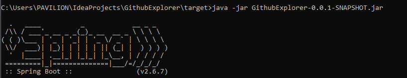
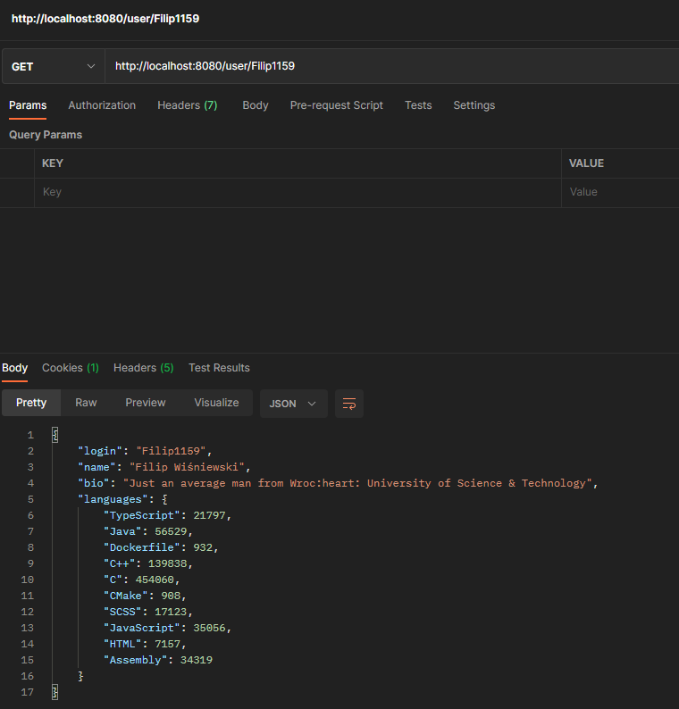
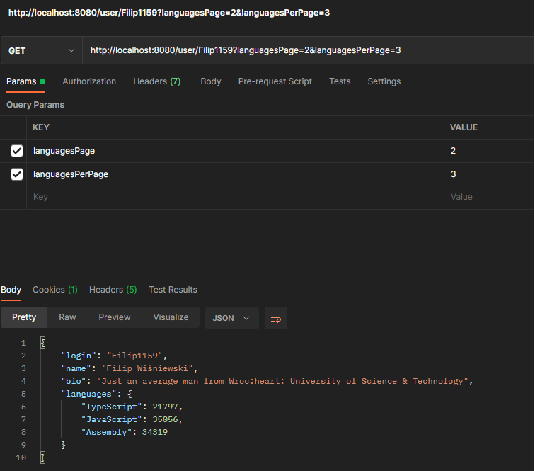
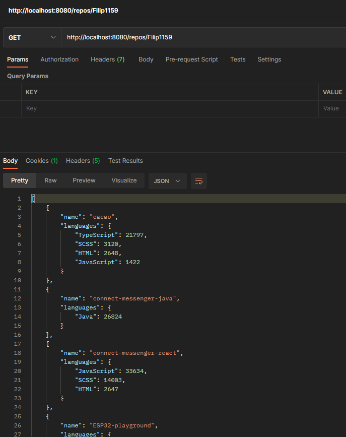
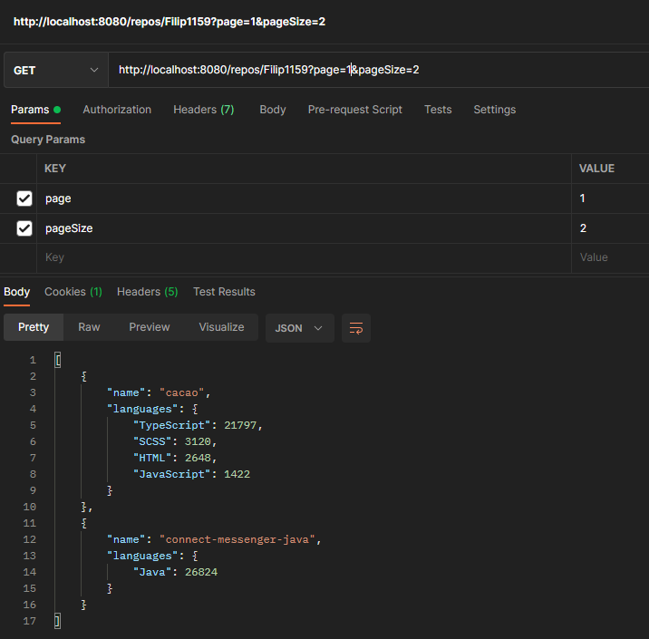
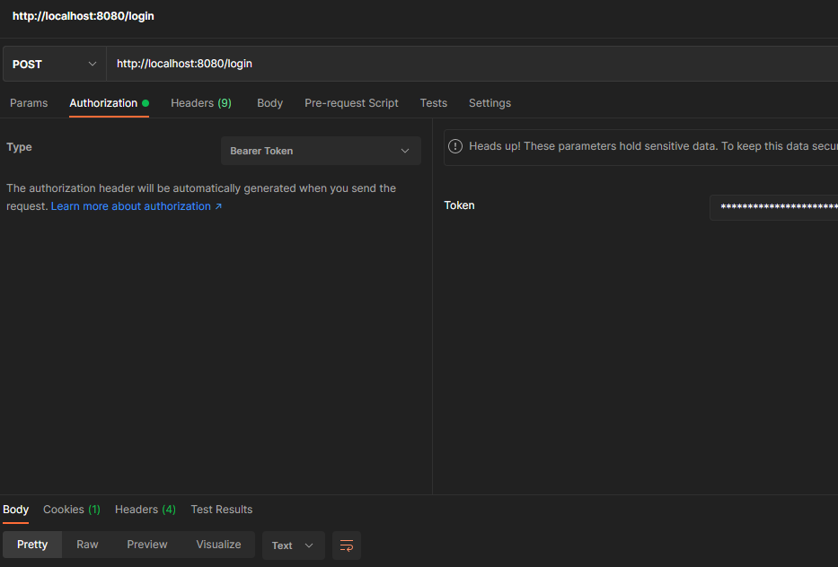

# allegro-summer-experience-2022
My email in recruitment process: [fwfw54111@gmail.com](mailto:fwfw541111@gmail.com)  
:heavy_check_mark: written using SpringBoot 2.6.7  
:heavy_check_mark: uses Spring WebClient for communication with [GitHub Api](https://api.github.com)  
:heavy_check_mark: supports and extends GitHub Api pagination  
:heavy_check_mark: supports authenticated requests, that increase request rate limit (from 60/hour to 5000/hour)  

Clone repo and run project with IntelliJ or generate jar using Maven (in Maven toolbar > Lifecycle > install). Start server on your localhost:8080  
 

See this in action using the following endpoints:  
:earth_africa: http://localhost:8080/user/{your-user-login} - fetch user login, name, bio and all languages  
 
:earth_africa: http://localhost:8080/user/{your-user-login}?languagesPage=2&languagesPerPage=5 - use pagination of languages  
 
By default, page number equals to 1 and pageSize equals to 10, if page is less than 1 it is ignored just like pageSize  
:earth_africa: http://localhost:8080/repos/{your-user-login} - fetch user repos and their languages  
 
:earth_africa: http://localhost:8080/repos/{your-user-login}?page=3&pageSize=8  
 
:earth_africa: http://localhost:8080/login - using POST method and Authorization header containing GitHub bearer access token  
 
:earth_africa: http://localhost:8080/logout - using POST, logout  

Missing functionality is definitely better error handling, possible improvement is parallel requests. Also tests can only be called a demo. Anyway, in those few days a quite nice app was created. Enjoy!